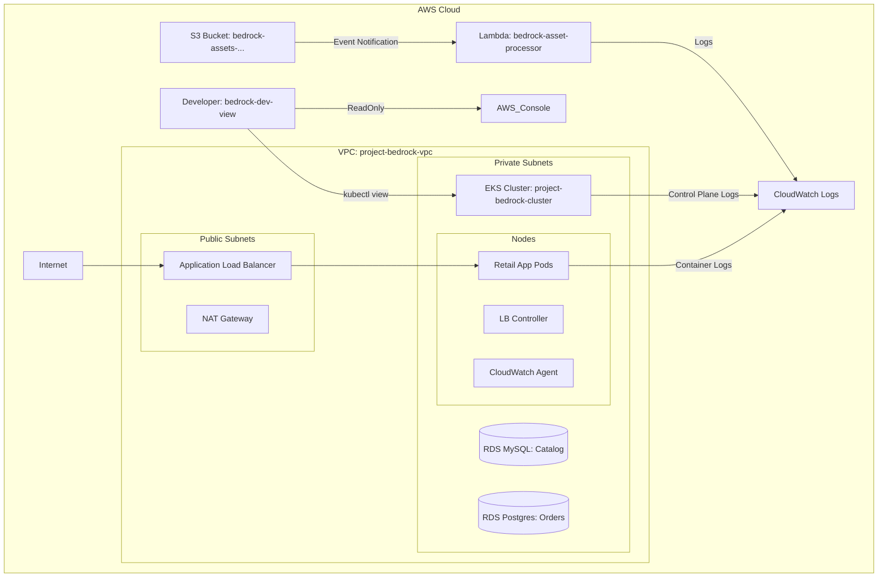

# Capstone Project Deliverables

**Submission For:** Innocent Chukwuemeka
**Email:** innocent@altschoolafrica.com

---

## 1. Git Repository Link
**Repository:** [https://github.com/Amarachi32/retail-store-sample-app/tree/capstone](https://github.com/Amarachi32/retail-store-sample-app/tree/capstone)

*Note: The infrastructure code, pipeline configurations, and application manifests are located in this repository.*

## 2. Architecture Diagram
Below is the high-level visual of the VPC, EKS, Data Layer, and S3-Lambda flow.



## 3. Deployment Guide

### How to Trigger the Pipeline
The CI/CD pipeline is configured using GitHub Actions.
1.  **Push Changes**: The pipeline automatically triggers on a push to the `main` branch.
    *   *Note: Since you are on the `capstone` branch, ensure you create a Pull Request to `main` or update `.github/workflows/terraform.yml` to trigger on `capstone`.*
2.  **Monitor Action**: Go to the **Actions** tab in the GitHub repository to see the "Terraform Infrastructure" workflow execution.

### Accessing the Retail Store
Once the pipeline completes and the `retail-store-ingress` is provisioned:
1.  Run the following command to get the Load Balancer URL:
    ```bash
    kubectl get ingress -n retail-app retail-store-ingress
    ```
2.  Copy the `ADDRESS` field (e.g., `k8s-retailap-retailst-....us-east-1.elb.amazonaws.com`).
3.  Paste the URL into your browser to access the store.

## 4. Grading Credentials
*These credentials allow the grader to verify the infrastructure as the `bedrock-dev-view` user.*

* **Access Key:** `[PASTE_ACCESS_KEY_HERE]`
* **Secret Key:** `[PASTE_SECRET_KEY_HERE]`

> **Instructions to retrieve these:**
> Run `terraform output` in your `terraform/` directory. Copy the values for `bedrock_dev_view_access_key` and `bedrock_dev_view_secret_key`.

## 5. Grading Data
To assist the grading script, a JSON representation of the infrastructure outputs is required.

1.  Navigate to your terraform directory:
    ```bash
    cd terraform
    ```
2.  Run the output command:
    ```bash
    terraform output -json > grading.json
    ```
3.  **Commit** the generated `grading.json` file to the root of your repository and push it.

## 6. Verification
### Application URL
- **Load Balancer URL**: [http://k8s-retailap-retailst-8798558661-1254347209.us-east-1.elb.amazonaws.com](http://k8s-retailap-retailst-8798558661-1254347209.us-east-1.elb.amazonaws.com) (Please allow a few minutes for DNS propagation)
- **Status**: Deployed & Accessible
